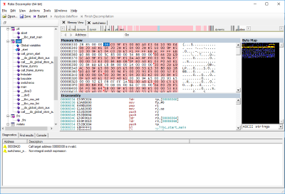
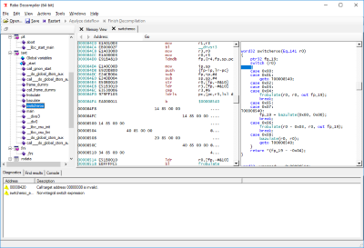

# reko - a general purpose decompiler.

[]
[](https://ci.appveyor.com/project/uxmal/reko)
 [](https://travis-ci.org/uxmal/reko) 
 [](https://discord.gg/9PMWVxEjqr)
 [](https://gitter.im/uxmal/reko?utm_source=badge&utm_medium=badge&utm_campaign=pr-badge&utm_content=badge)

 
 

**Reko** (Swedish: "decent, obliging") is a decompiler for machine code binaries.
This project is freely available under the GNU General Public License.

The project consists of front ends, core decompiler engine, and back
ends to help it achieve its goals.  A command-line, a Windows GUI,
and a ASP.NET front end exist at the time of writing.  The decompiler
engine receives inputs from the front ends in the form of either
individual executable files or decompiler project files. Reko
project files contain additional information about a binary file,
helpful to the decompilation process or for formatting the output.
The decompiler engine then proceeds to analyze the input binary.

<table>
    <tr>
        <td>
            <a href="doc/img/mem-map-full.png"></a><br />
            Byte map view of a loaded ARM binary executable
        </td>
        <td>
            <a href="doc/img/structure-full.png"></a><br />
            Decompiled view of a loaded ARM binary executable
        </td>
    </tr>
</table>

Reko has the ambition of supporting decompilation of various 
processor architectures and executable file formats with minimal user
intervention. For a complete list, see the
[supported binaries](https://github.com/uxmal/reko/wiki/Supported-binaries) 
page.

Please note that many software licenses prohibit decompilation or
other reverse engineering of their machine code binaries. Use this
decompiler only if you have legal rights to decompile the binary
(for instance if the binary is your own.)

## Downloading Reko

Official releases are published every few months on [Github](https://github.com/uxmal/reko/releases)
and [SourceForge](https://sourceforge.net/projects/decompiler/files/). 
Users who can't or won't build Reko themselves can download the output
of the [AppVeyor integration builder](https://ci.appveyor.com/project/uxmal/reko/build/artifacts).
Naturally you can build the project from the sources: see "Hacking" 
below.

## Installing Reko

### Windows users

The following prerequisite software must be installed on your machine first:
* .NET Core 3.1 (https://www.microsoft.com/net/download/dotnet-framework-runtime)

Download an MSI file from one of the places mentioned above, then simply run
the installer.

### Non-Windows users

The following prerequisite software must be installed on your machine first:
* .NET Core 3.1 for Linux (https://docs.microsoft.com/en-us/dotnet/core/install/linux)
* .NET Core 3.1 for macOS (https://docs.microsoft.com/en-us/dotnet/core/install/macos)

After installing .NET Core as appropriate for your operating system, you can proceed 
by either downloading binaries directly from the integration build server, or by 
building Reko from sources (see `Hacking` below).

## Documentation

To get acquainted with Reko's various features, you can read the 
[user's guide](doc/guide/reko.md). If you're interested in the internal workings
of the project, see the wiki.

## Getting support

You can report any issues you encounter or ask any Reko-related question
on the [issue tracker](https://github.com/uxmal/reko/issues).
You can also try the Reko [Gitter.im](https://gitter.im/uxmal/reko)
chatroom. Reko is built by volunteers' efforts on their
spare time, so adjust your response-time expectations accordingly.

## Hacking

To build reko, start by cloning https://github.com/uxmal/reko. You
can use an IDE or the command line to build the solution file
`Reko-decompiler.sln`. Reko requires .NET Core 3.1 and C# 8
to compile. If you are an Windows IDE user, use Visual Studio 2019 or
VS Code. If you wish to build using the command line, use the command

```cmd
msbuild /p:Configuration={config} /p:Platform={platform} Reko-decompiler.sln
```
(provided you have ```msbuild``` installed). Replace `{config}` with either
`Debug` or `Release`, and `{platform}` with `x64` or `x86`. All external
dependencies needed to build Reko are included in the `external` directory.

**Note**: please let us know if you still are not able to compile,
so we can help you fix the issue.

If you're interested in contributing code, see the
[road map](https://github.com/uxmal/reko/wiki/Roadmap) for areas to explore.
The [Wiki](https://github.com/uxmal/reko/wiki) has more information
about the Reko project's internal workings. Please consult the
 [style guide](https://github.com/uxmal/reko/blob/master/doc/style.md).

### Warnings and errors related to WiX

You will receive warnings or errors when loading the solution in Visual Studio
or MonoDevelop if you haven't installed the WiX toolset on your
development machine. You can safely ignore the warnings; the WiX
toolset is only used when making MSI installer packages, and isn't even
supported in MonoDevelop. You will not need to build an installer if
you're already able to compile the project: the build process copies
all the necessary files into If you do want to build an MSI installer
with the WiX toolchain, you can download it here:
http://wixtoolset.org/releases/

### Errors related to CMake in Visual Studio

Depending on what you do Visual Studio might try to rebuild NativeProxy which
depends on CMake. You can either install [CMake](https://cmake.org/download/)
and make sure it's added to your PATH or disable the project in Visual Studio.

Having CMake installed as part of Visual Studio is sufficient to run msbuild
from the `Developer Command Prompt` but not when building from inside VS,
unless you've added that to your global PATH. Installing CMake externally allows
you to add it to PATH during the installation.

### How do I start Reko?

The solution folder `Drivers` contains the executables that act
as user interfaces: the directory `WindowsDecompiler` contains
the GUI client for Windows users; `MonoDecompiler` contains the GUI
client for Mono users; `CmdLine` is a command line driver.

## Recent versions

See NEWS.md for the change log.
