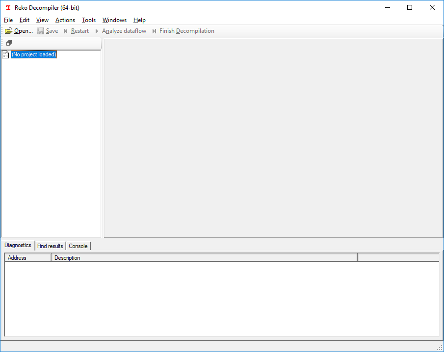
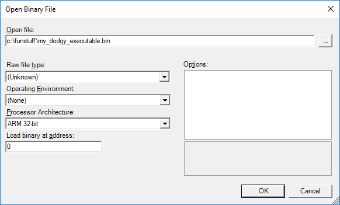
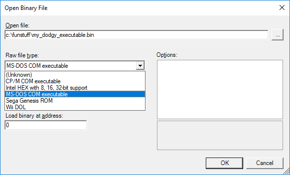
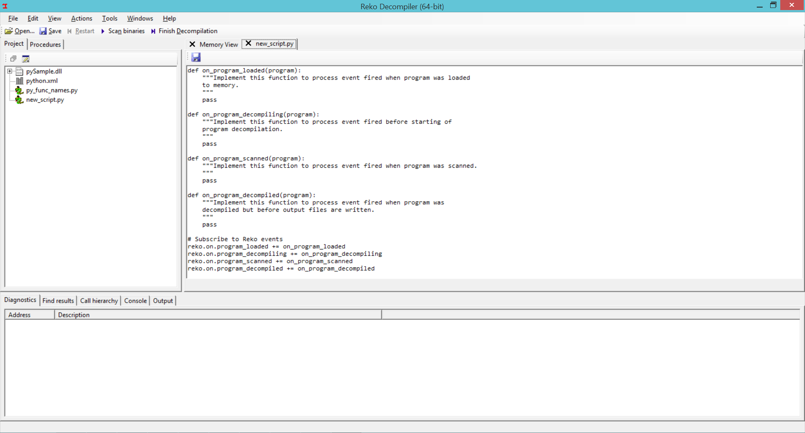
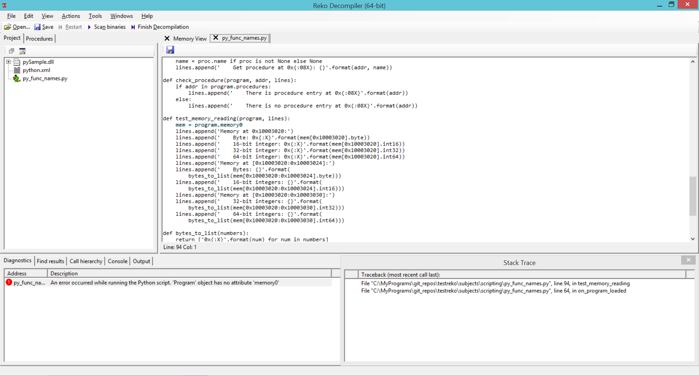
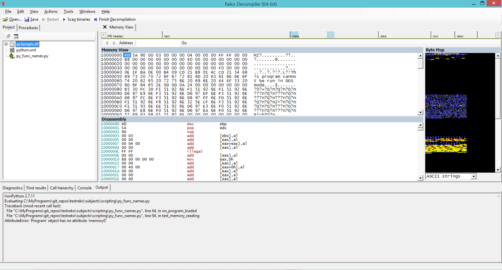
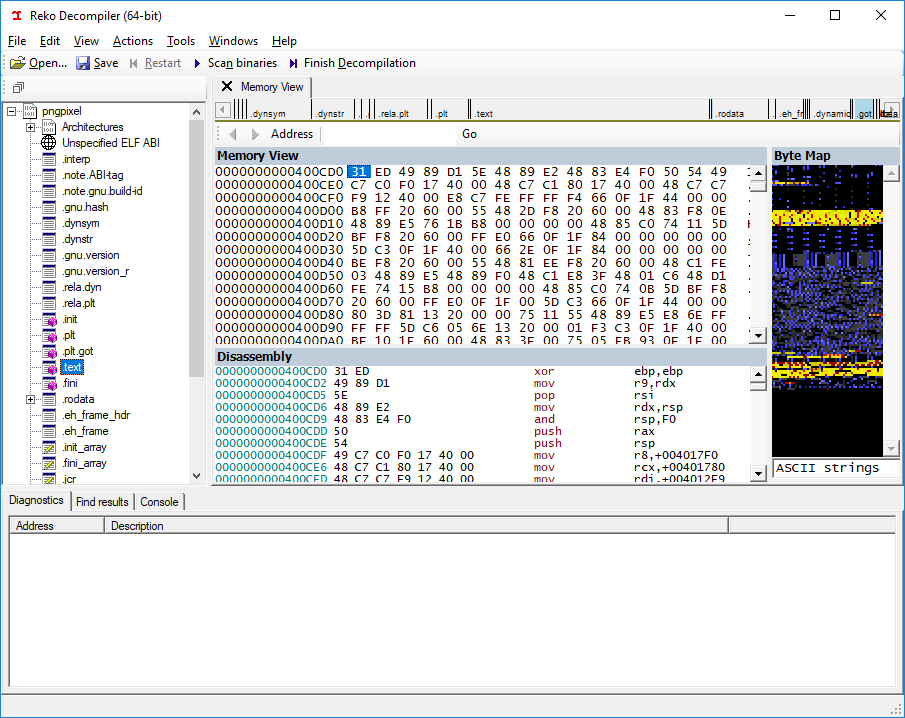
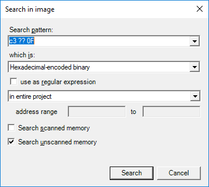

# Reko decompiler GUI tutorial

This tutorial will familiarize you with Reko graphical user interface (GUI), and how to use it to analyze and decompile binary programs.

Once Reko has been [installed](reko.md) and launched you'll see the main screen:

The screen area is divided into the command and menu bars on the top, the [project browser](project_browser.md) on the left, the search and diagnostics panes on the bottom.

## Loading binary files
Reko starts with a empty project. Analysis of a binary file starts by adding it to the project with the `File > Open` menu command. Reko will attempt to determine what binary file format the file is in. Well-known formats like MS-DOS / Windows EXE files will be loaded automatically; their internal structure will be traversed and the results displayed in the project browser:

### Loading files with unknown formats
Some executable files have formats that that Reko doesn't support (yet!). If you attempt to load an unsupported file format, Reko will show the `Open Binary File` dialog. 

You are then prompted to supply the missing pieces of information Reko requires to make sense of the binary. At the very least, you must supply the processor architecture corresponding to the machine code in the binary file. **Note**: if there is a binary file ormat or processor architecture you wish to work with, and that aren't currently supported by Reko, please [create an issue](https://github.com/uxmal/reko/issues) on GitHub.

### Loading files with incomplete metadata
Some binary files will contain incomplete metadata. For instance, an MS-DOS `com` file contains x86 machine code stored as a structureless chunk of bytes. There is no file header or any other clue that tells Reko that the contents are executable. In addition, the `com` file extension is also used by CP/M, which means the contents of the file might be Intel 8080 or Zilog Z80 machine code instead. Because of this ambiguity, the user must resolve this ambiguity by picking the appropriate file format from the Open Binary File dialog:

## Loading external metadata files
Reko supports loading extra metadata to assist the decompilation process. Such metadata files contain symbolic and type information that supplement the machine code in the binary file being decompiled. To load a metadata file, use the `File > Add metadata file...` menu command.

## Adding script files
User-defined [scripts](scripting.md) can be created to customize the Reko
decompilation process. To create a new script
[file](scripting.md#reko-script-files), use the `File > New script file...` menu
command. Existing files can be added to project with the `File > Add script file...`
menu command. Scripts can be viewed and edited using the Reko text editor.

If exception was raised during script execution, it's possible to view the stack
trace by double clicking on the error in the `Diagnostic` tab. Double clicking on each stack
frame moves text editor to corresponding script line.

Console output from scripts can be viewed in the `Output` tab.

## The project browser
Once a binary file is loaded, Reko displays an overview of its contents in the **project browser**, located on the left side of the screen. Any metadata found in the file or supplied by the user is displayed there. One of the most important pieces of metadata are the **sections** or **segments** of the file.

## The memory viewer
Many of the items in the project browser react to selection. Selecting a section in the project browser will navigate to the beginning of that section in memory and display a hex dump:

The memory viewer shows a part of the loaded program's memory. The display is divided into an upper part, which shows a hex dump, and a lower part, which shows a disassembly of the same part. Above the hex dump is a navigation bar which allows rapid navigation to different parts of the binary. To the right is a "heat map", which displays data in memory. 

Both the the navigation bar and the heat map will update the memory viewer when a particular pixel is selected. In addition, the navigation bar can be zoomed in and out with the '+' and '-' keys respectively, or by using the mouse wheel.

## Finding byte patterns
Reko supports searching for byte patterns, complete with regular expression support. To search, use the `Edit > Find...` menu command: 

Search patterns are bytes, specified as pairs of hexadecimal digits. The pattern `0F` matches any occurrences of the byte `0x0F`. Longer search patterns are formed by concatenating hex digit pairs. Spaces are ignored: the patterns `42 42` and `4242` match the same byte sequence, `0x42, 0x42`.

A 'don't care' byte is specified by the `??` pattern. The search pattern `C3 ??` will match the bytes `0xC3, 0x00`, `0xC3, 0xAA` and `0xC3, 0xFF` but not `0xC2, 0x00`.

Using an asterisk `*` after a pattern will match 0 or more occurrences of the pattern. Thus, `C3 90*` will match the byte patterns `0xC3`, `0xC3, 0x90`, `0xC3, 0x90, 0x90` and so on. 

Using a plus sign `+` after a pattern will match one or more occurrences of a pattern. Thus, `C3 90+` will match the byte patterns `0xC3, 0x90` and `0xC3, 0x90, 0x90`, but not `0xC3, 0x49`.

Search patterns can be grouped with parentheses. The pattern `(AA BB)+` will match the bytes sequences `0xAA, 0xBB`, `0xAA, 0xBB, 0xAA, 0xBB`, `0xAA, 0xBB, 0xAA, 0xBB, 0xAA, 0xBB` and so on.

Pattern alternatives can be specified with the pipe `|` operator. The pattern `C3 | 90` matches either the byte `0xC3` or `0x90`. Byte ranges can be specified withing brackets `[` and `]`. The pattern `[00-03]` will match the bytes `0x00`, `0x01`, `0x02`, or `0x03`.

Clicking `OK` after specifying a search pattern executes the search. The search results are displayed in the `Search results` tool window at the bottom of the Reko window. Double-clicking on a search result hit navigates you in the memory map to that location.

## Finding strings
Finding sequences of bytes that look like encoded ASCII character strings is a common task. To search for strings, use the `View > Find strings...` menu command to open the `Find possible strings` dialog. 
